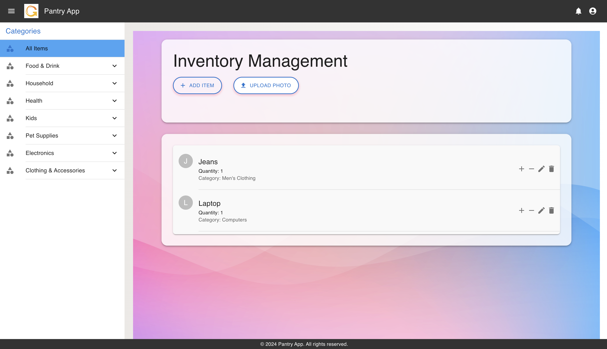

# Pantry_App
## Overview

This project is an Inventory Management System that allows users to upload photos of items. The system identifies the items from the photos, updates the inventory accordingly, and provides a user-friendly interface for managing and viewing items categorized by different types.




### Key Features

- **Photo Upload**: Upload images of items to automatically identify and add them to the inventory.
- **Inventory Management**: View, add, edit, and remove items from the inventory.
- **Category Management**: Organize items into various categories for better management.
- **Responsive Design**: Adaptable interface for different screen sizes and devices.

## Technologies Used

- **Frontend**: React, Material-UI
- **Backend**: Node.js, Express, Multer
- **Database**: Firebase Firestore
- **Image Processing**: Custom API for image recognition

## Installation

### Prerequisites

- Node.js and npm
- Firebase account and configuration

### Setup

1. **Clone the Repository**

   ```bash
   git clone https://github.com/your-username/inventory-management-system.git
   cd inventory-management-system
   ```

2. **Install Dependencies**

   Navigate to both the frontend and backend directories and install the dependencies:

   ```bash
   cd frontend
   npm install

   cd ../backend
   npm install
   ```

3. **Configure Firebase**

   Create a `firebaseConfig.js` file in the `frontend/src` directory with your Firebase configuration:

   ```javascript
   export const firebaseConfig = {
     apiKey: "YOUR_API_KEY",
     authDomain: "YOUR_AUTH_DOMAIN",
     projectId: "YOUR_PROJECT_ID",
     storageBucket: "YOUR_STORAGE_BUCKET",
     messagingSenderId: "YOUR_MESSAGING_SENDER_ID",
     appId: "YOUR_APP_ID",
   };
   ```

4. **Run the Backend Server**

   Start the backend server:

   ```bash
   cd backend
   npm start
   ```

   The server will be running on `http://localhost:5000`.

5. **Run the Frontend Application**

   Start the frontend application:

   ```bash
   cd frontend
   npm start
   ```

   The application will be available at `http://localhost:3000`.

## Usage

1. **Upload Photo**: Use the "Upload Photo" button to select and upload images of items. The system will process the image, identify the item, and add it to the inventory.
2. **View Inventory**: Browse through items categorized by different types using the sidebar.
3. **Add/Edit Items**: Use the dialog form to add new items or edit existing ones.
4. **Remove Items**: Select an item from the inventory and remove it as needed.

## API Endpoints

- **POST /api/sendphoto**: Upload an image and receive item identification results.

## Contributing

1. Fork the repository.
2. Create a new branch (`git checkout -b feature-branch`).
3. Make your changes.
4. Commit your changes (`git commit -am 'Add new feature'`).
5. Push to the branch (`git push origin feature-branch`).
6. Create a new Pull Request.

## License

This project is licensed under the MIT License - see the [LICENSE](LICENSE) file for details.
